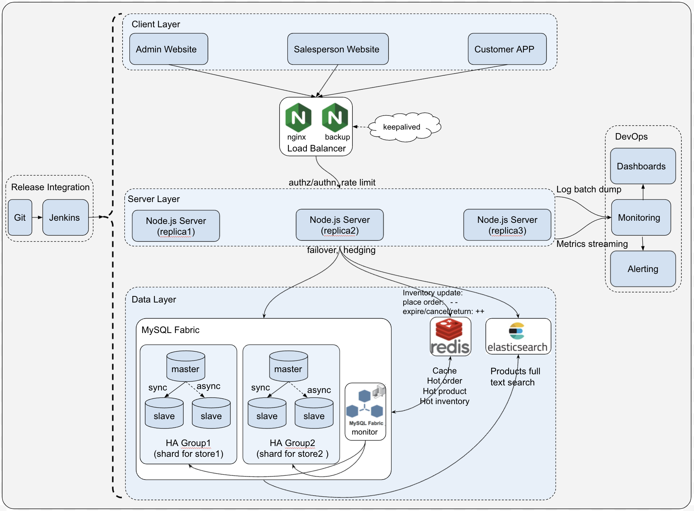

## Elastic Mobile E-Commerce Platform

### Summary

Elastic Mobile E-Commerce (a.k.a. E-MEC) is an online-to-offline e-commerce platform. This platform entirely consolidates the online and offline shopping, so as to
provide customers a natural and super-convenient shopping experience. Customers can use our APP to place dining-in order in advance, and then
consume it after they come to the store and finish other shoppings. Customers can use our APP to scan the QRcode of a large furniture to purchase it online and
deliver it home. Customers can still enjoy the offline shopping, and have salesperson place the order. So E-MEC has totally break through the barrier between
online shopping and offline shopping.

Right now, this system has been adopted by several large malls and retailing stores in Shanghai, to facilitate their O2O digital transformation. It was exhibited
in Shanghai New International Expo Center and gain great reputation.

### Demo

* Salesperson UI: https://34.123.176.202:3001 (demo - data sanitized) 
* Admin UI: http://34.123.176.202:2000 (demo - data sanitized) 
* APP: see the screenshot below.

### Skillset

* **Backend**: *Node.js*, *Express*
* **Frontend**: *EJS*, *Javascript*, *HTML/CSS*
* **Data Storage**: *MySQL Fabric*, *ElasticSearch*
* **Launch**: *on-prem DevOps*, *Nginx*
* **App**: *App development*

### Requirements

* Functional Requirement:
  * Customers
    * Account
    * Product
    * Cart
    * Order
    * Payment
    * Logistics
    * Return
  * Salespersons
    * Account Management
    * Product Management
    * Price Management
    * Inventory Management
    * Promotion management
    * Cart Management
    * Order Management
    * Payment Management
    * Logistics Management
    * Return Management
  * Admins
    * Account Super Management
    * Store Super Management
    * Crypto Key Super Management
    * Activities Super Management
    
* Non-functional Requirement
  * Availability: >99.95%
  * Latency: UI-friendly 
  * Throughput: support >1k QPS/TPS during peak hours (like 11.11, China's Black Friday)

### Design & Architecture

### Exhibition (data sanitized)

* APP landing pages:

---
* Salesperson login page:

---
* Salesperson adds/modify/import SKU:

---
* Salesperson publishes SKU online information:

---
* Salesperson validate SKU:

---
* Salesperson manages price:

---
* Salesperson manages inventory:

---
* Salesperson places offline order:

---
* Salesperson accepts online order:

---
* Salesperson cancels order:

---
* Salesperson creates order return request:

---
* Salesperson manages delivery:

---
* Salesperson traces delivery:

---
* Admin creates other admin account:

---
* Admin creates salesperson account:

---
* Admin creates store/counter account:

---
* Admin publishes promotion activities:

---
* Admin resets account:

---
* Admin updates crypto keys:

---
