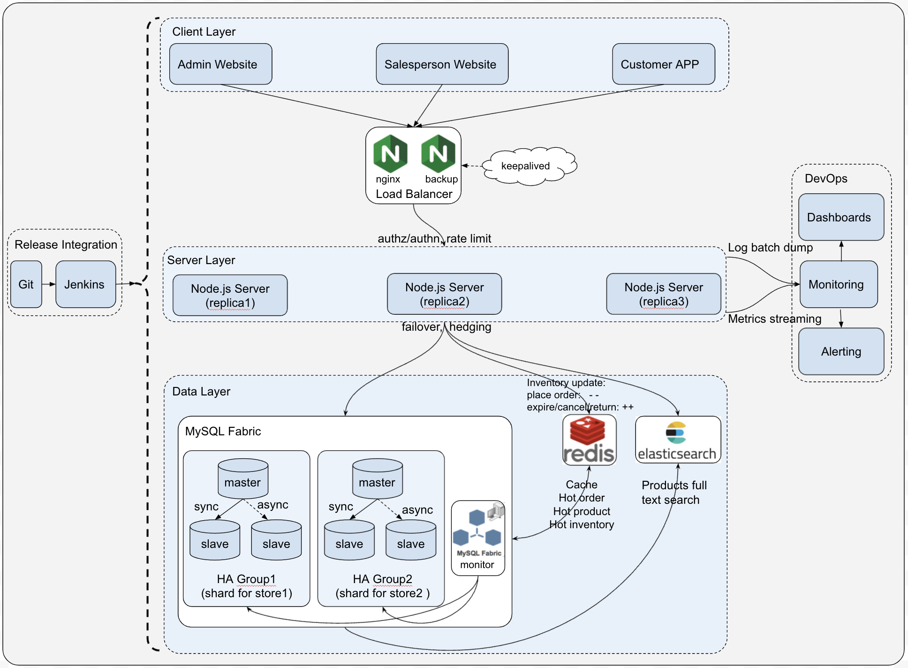
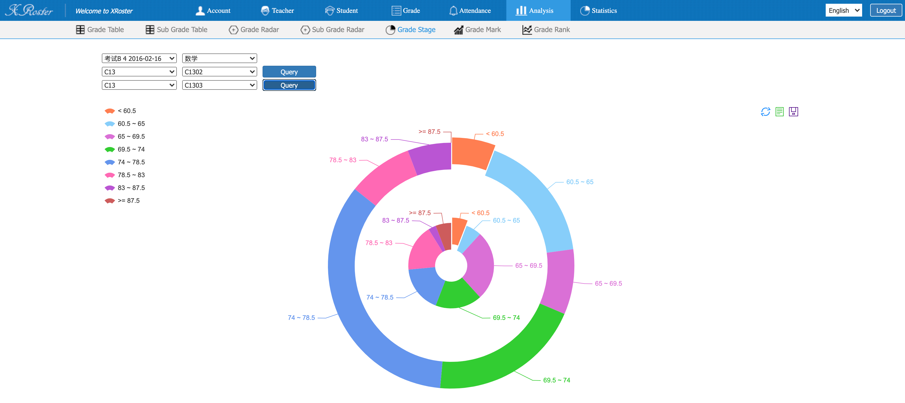
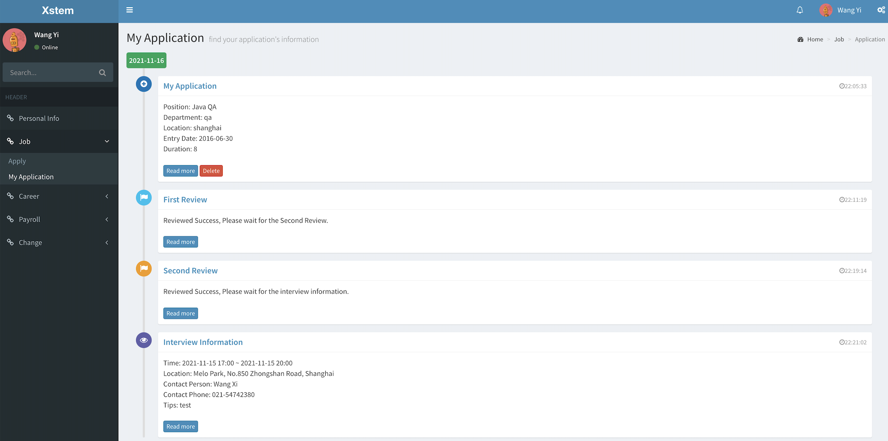
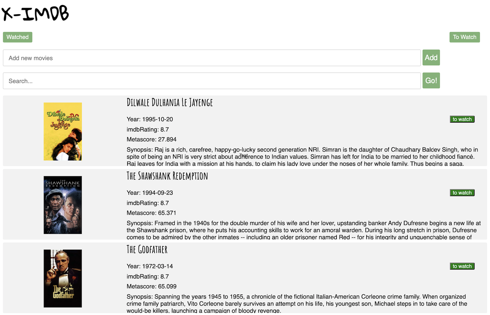
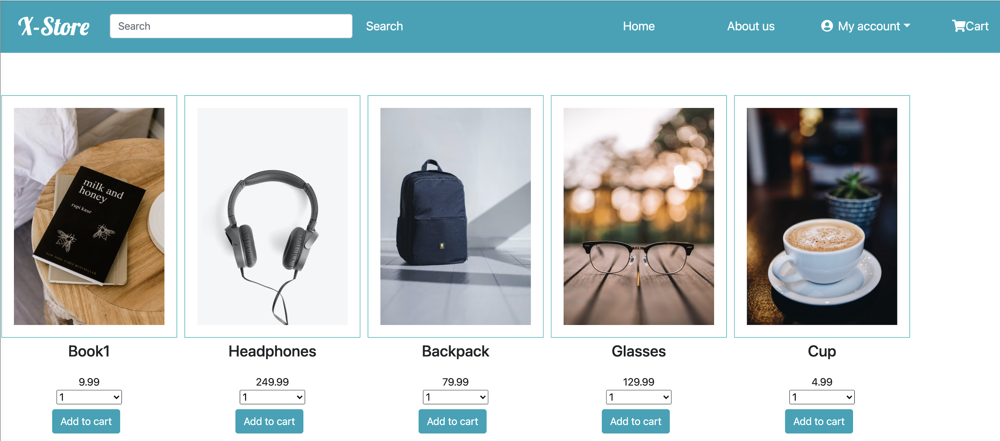

# Mission

As a full stack software engineer, I always believe my ultimate goal is to make a perfect product. Sometimes, it's like a dream that's not something I can achieve in the short term, but I will keep pursuing it in my life. I love technologies. I love the world. No matter where I am, in my hometown China or relocated to the US，I wish I can use technologies to make the world a little bit better. No matter how my life evolves, this mission remains constant.

# Projects

### Elastic Mobile E-Commerce Platform

**Links**: [project details](./emec.md), [demo sanitized](https://34.123.176.202:3001)

**Skillsets**: *Nodejs, HTML/CSS, Mysql Fabric, ElasticSearch, Nginx, on-prem DevOps*

**Summary**: Elastic Mobile E-Commerce (a.k.a. E-MEC) is an online-to-offline e-commerce platform. It has been adopted by several large malls and retailing stores in Shanghai, to facilitate their O2O digital transformation.

---

### Student Performance Analysis System 

**Links**: [project details](./xroster.md), [demo on AWS](http://34.123.176.202:8080)

**Skillsets**: *AWS, Java, SpringBoot, Redis, PostgreSQL, Echarts, HTML/CSS*

**Summary**: A web application for managing students/teachers information, importing/recording students' scores, and analyzing/visualizing students’ performance. Created multiple analysis algorithms/pipelines from different dimensions. Built fancy UI and diagrams for visualization.

---

### STEM Recruiting System

**Links**: [project details](./xstem.md), [demo on AWS](http://34.123.176.202:8081)

**Skillsets**: *Java, Maven, MySQL, Javascript, Bootstrap, HTML/CSS, AWS*

**Summary**: A system for HR, hiring managers and candidates, to interact with each other during the recruiting process, in STEM industry. Designed and built a user-friendly UI for operating through the whole recruiting life cycle.

---

### Movie Search Engine

**Links**: [project details](./ximdb.md), [demo on GCP](http://35.225.43.107:5000)

**Skillsets**: *React, Elasticsearch, Node.js, HTML/CSS, GCP*

**Summary**: a Cloud-hosted searchable IMDB , by retrieving data from 3rd party movies API and utilizing a full-text search framework to support token-based query.

---

### Online Grocery Store

**Links**: [project details](./xstore.md), [demo on GCP](http://35.225.43.107:4200)

**Skillsets**: *Angular, Nodejs, PostgreSQL, Express, HTML/CSS, GCP*

**Summary**: A concise and elegant grocery website, wrote in Angular and deployed on GCP compute engine.

---
