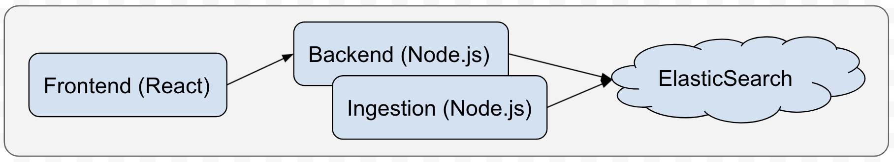
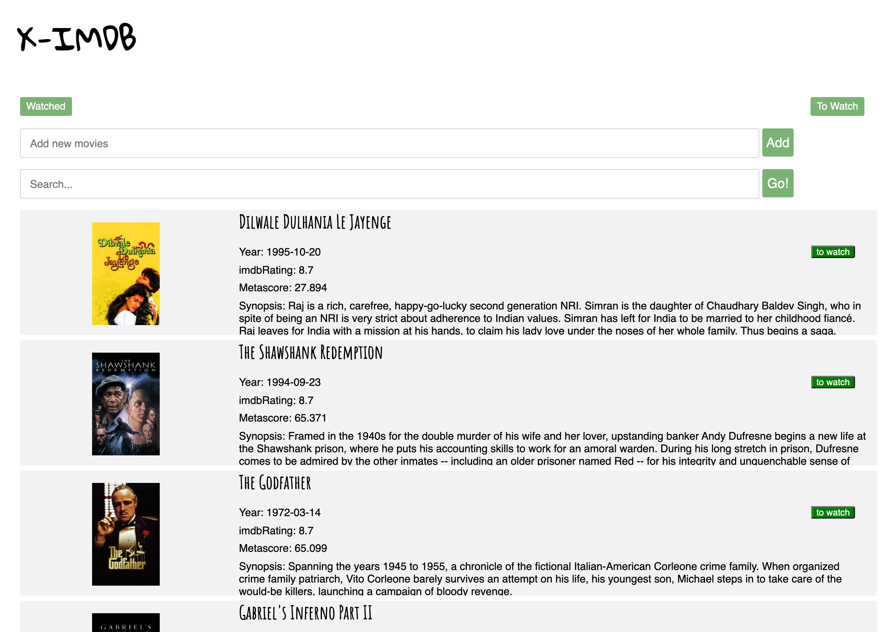
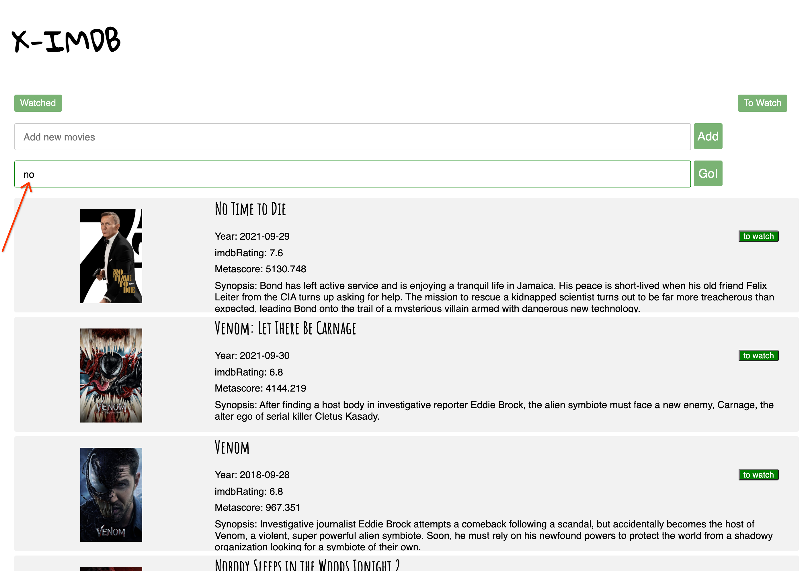
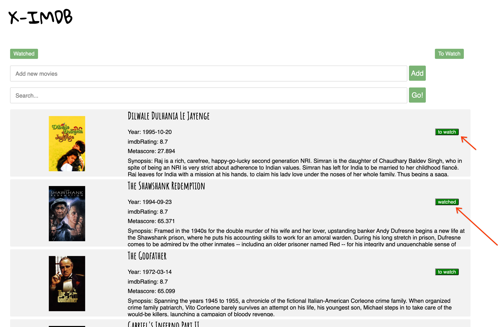
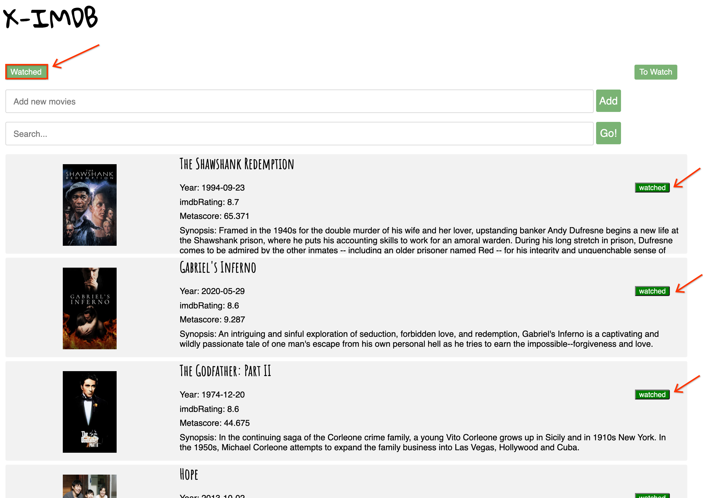

# Movie Search Engine

### Summary

a Cloud-hosted searchable IMDB , by retrieving data from 3rd party movies API and utilizing a full-text search framework to support token-based query.

### Demo

* [http://35.225.43.107:5000](http://35.225.43.107:5000) (deployed on GCP)
* no access control

### Skillset

* **Frontend**: *React*, *Javascript*, *HTML/CSS*
* **Backend**: *Node.js*
* **Search Engine**: *Elasticsearch*
* **Launch**: *GCP*

### Design & Architecture

### Exhibition

* Movie Search Engine landing page:

---

* Users can search movies:

---

* Users can mark a movies as watched or to be watched:

---

* Users can filter the watched movies:

---
