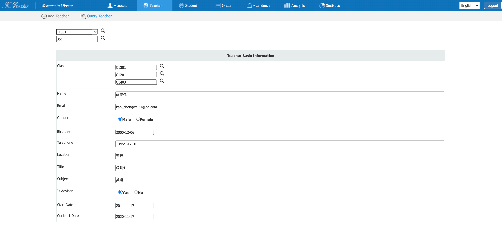
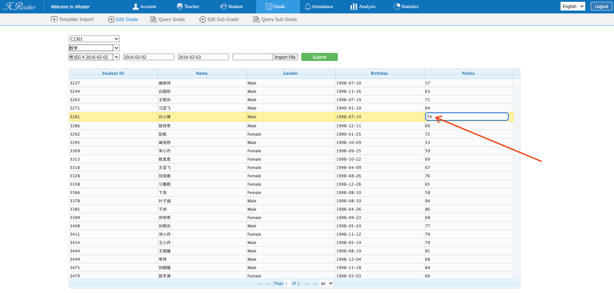

# Student Perf Analysis System

### Summary

A web application for managing students/teachers information, importing/recording students' scores, and analyzing/visualizing students’ performance.
Created multiple analysis algorithms/pipelines from different dimensions. Built fancy UI and diagrams for visualization.

### Demo

* [http://34.123.176.202:8080](http://34.123.176.202:8080) (deployed on AWS)
* username: test@qq.com
* password: 123

### Skillset

* **Backend**: *Java*, *SpringBoot*, *JOOQ*
* **Frontend**: *ECharts*, *Javascript*, *HTML/CSS*
* **Data Storage**: *PostgreSQL*, *Redis*
* **Launch**: *AWS*

### Design & Architecture

### Exhibition

* Login: Teachers or Admins can login to the student performance Analysis System:

---

* I18n Support: All the web pages support international languages:

---

* Account Management: Admins can manange the accounts:

---

* Account Management: Admins can add and query teach products:

---

* Student Information: Teachers can import and query student information:

---

* Student Attendence: Teachers can edit and query student attedence:

---

* Student Score: Teachers can import, edit and query student score:

---

* Student Attendence Analysis: Analysis student attendence:

---

* Student Performance Analysis: Performance summary

---

* Student Performance Analysis: Metrics radar and comparison

---

* Student Performance Analysis: Range analysis and comparison

---

* Student Performance Analysis: Score history and trend

---

* Student Performance Analysis: Rank history and trend

---
