# STEM Recruiting System

### Summary

A system for HR, hiring managers and candidates, to interact with each other during the recruiting process, in STEM industry.
Designed and built a user-friendly UI for operating through the whole recruiting life cycle.

### Demo

* [http://34.123.176.202:8081/](http://34.123.176.202:8081/) (deployed on AWS)
* Candidate accounts:
    * w1@qq.com
    * w2@qq.com
    * w3@qq.com
* HR account:
    * hr@qq.com
* Hiring manager accounts:
    * mg1@qq.com
    * mg2@qq.com
* Password for all the above accounts: 123

### Skillset

* **Backend**: *Java*, *SpringBoot*, *JOOQ*, *Maven*
* **Frontend**: *Javascript*, *Bootstrap*, *HTML/CSS*
* **Data Storage**: *MySQL*
* **Launch**: *AWS*

### Design & Architecture

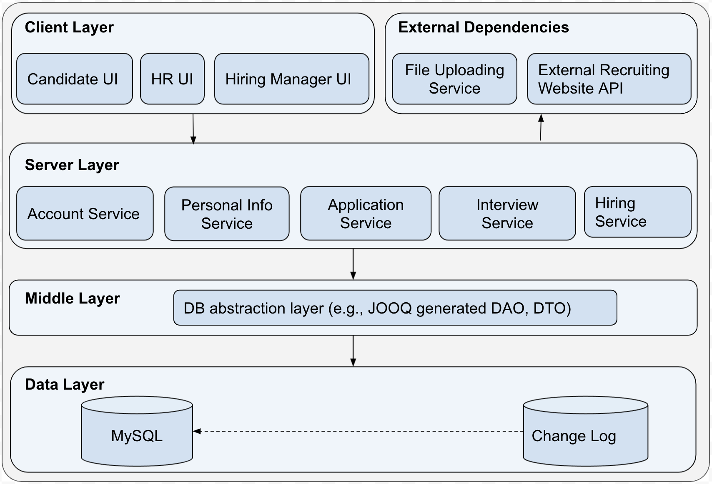

### Exhibition

* Recruiting system landing page, Candidate/HR/Hiring Manager have different entrances:

---

* Recruiting system sign up page:
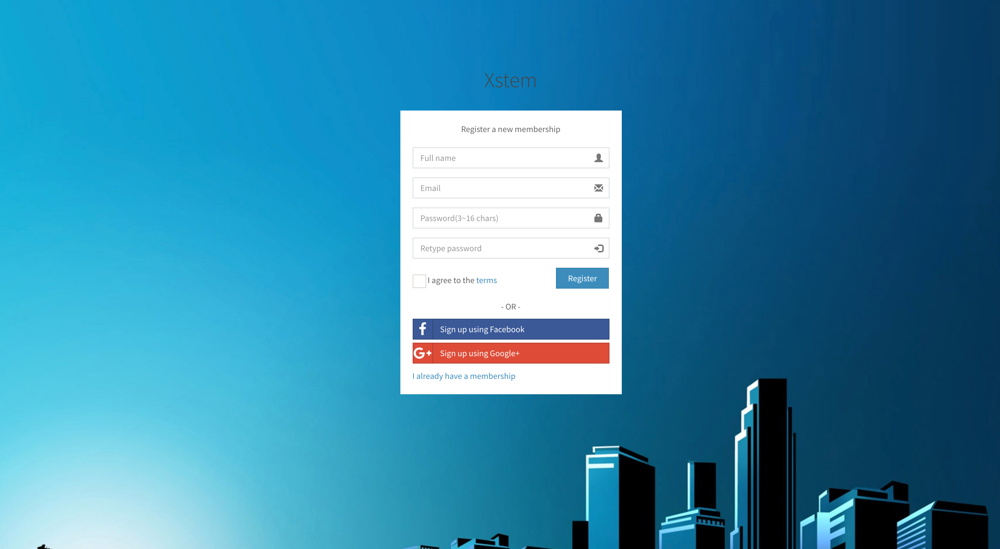

---

* Recruiting system login page:

---

* Hiring Manager creates an openning position:
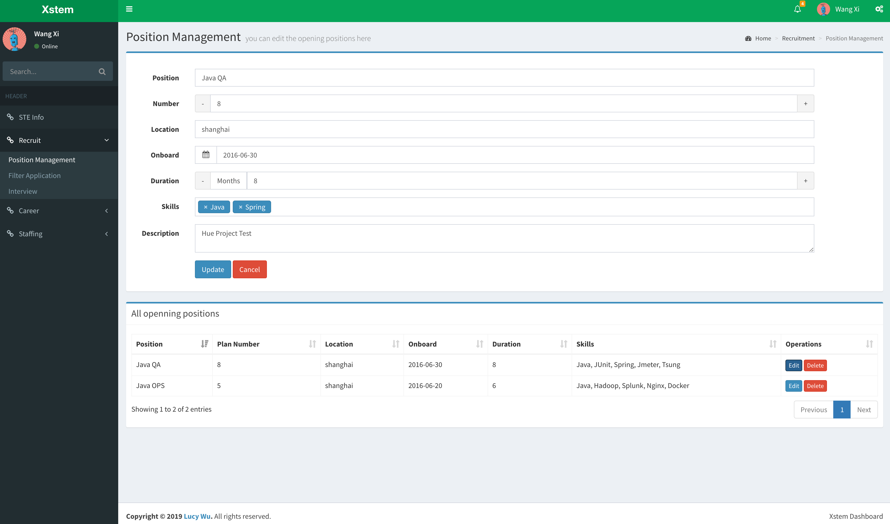

---

* HR review and publishes the jobs to external websites:
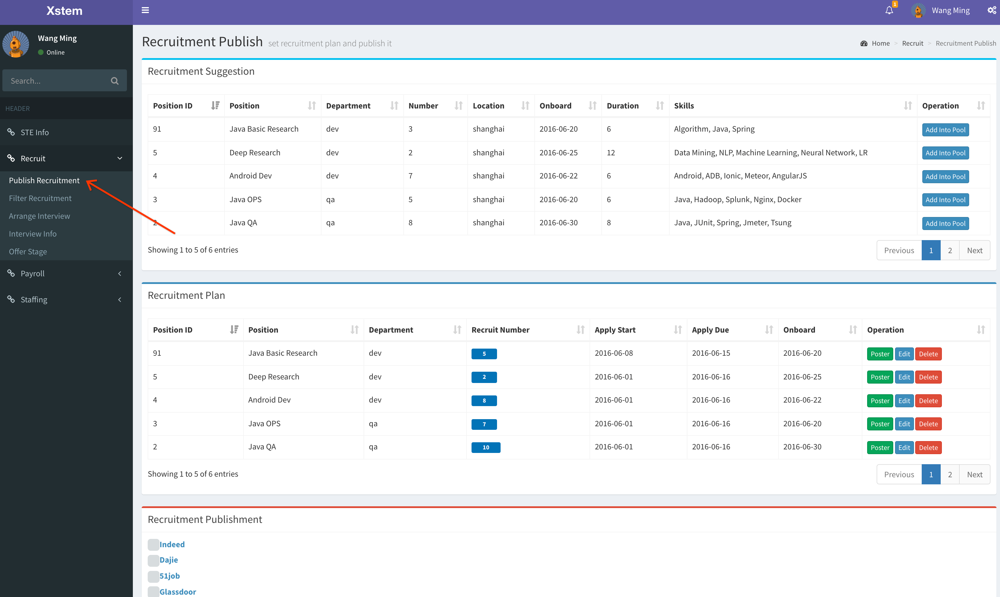

---

* Candidate logins to the system and fill in personal information:
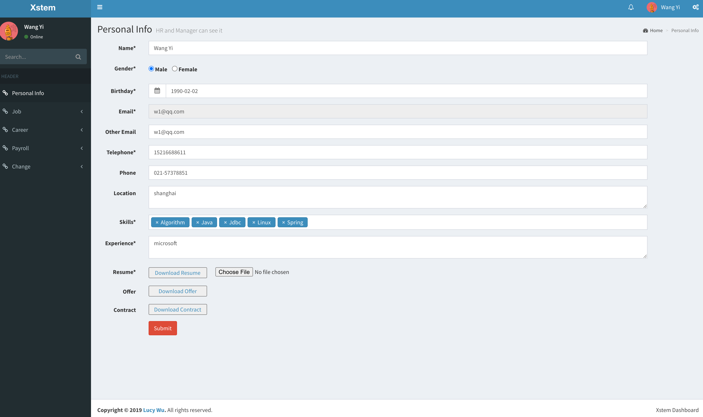

---

* Candidate applies for a job position:
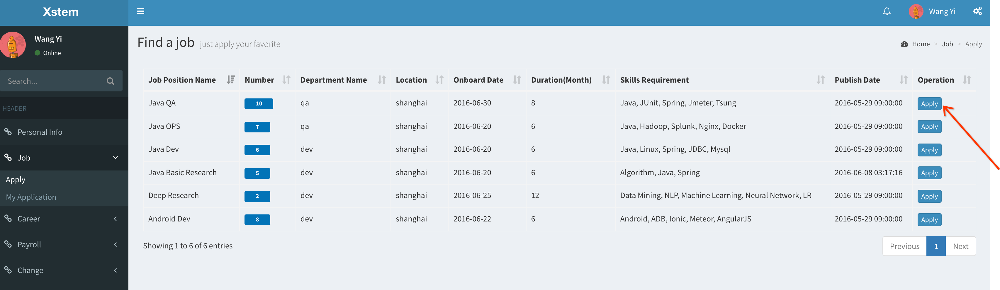

---

* HR gets notification of new candidation applications:
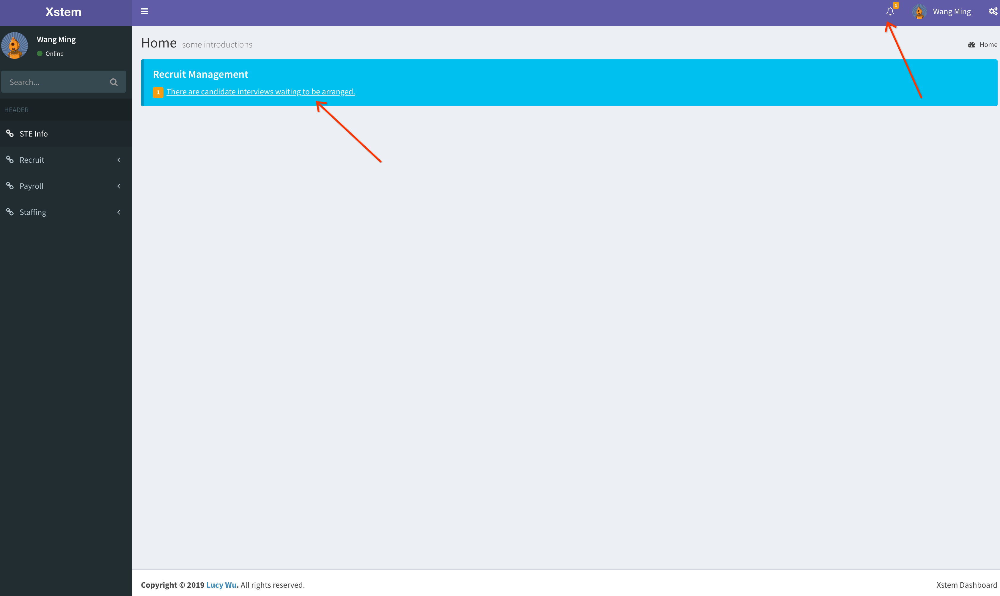

---

* HR initially reviews the candidates' application:
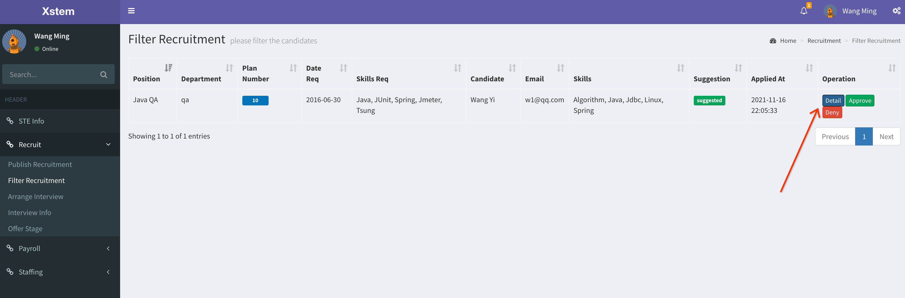
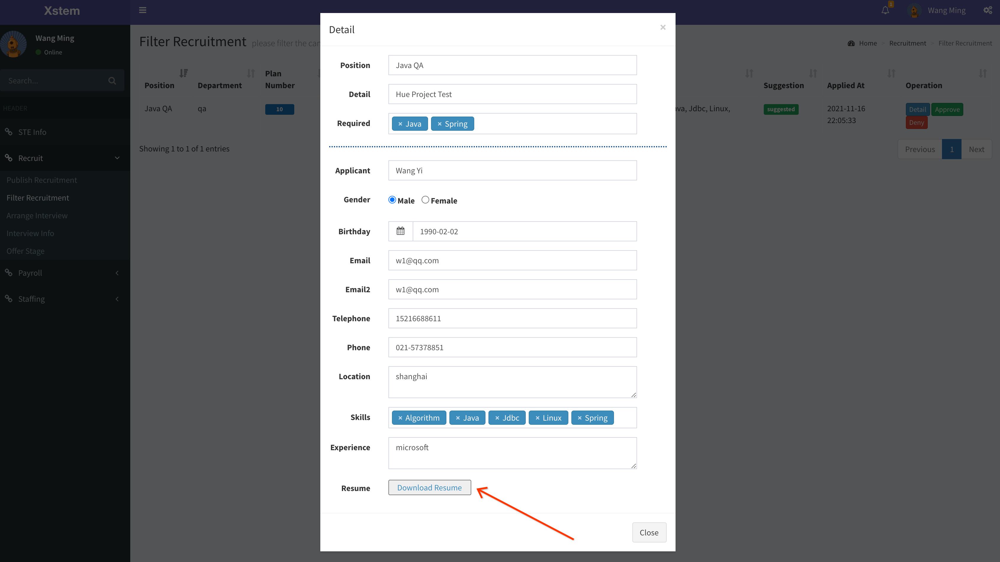

---

* Hiring Manager double reviews the candidates' application:
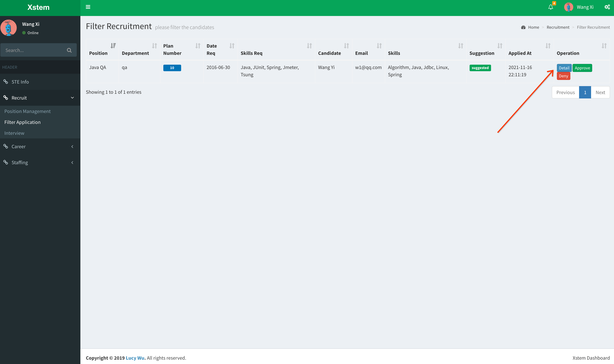
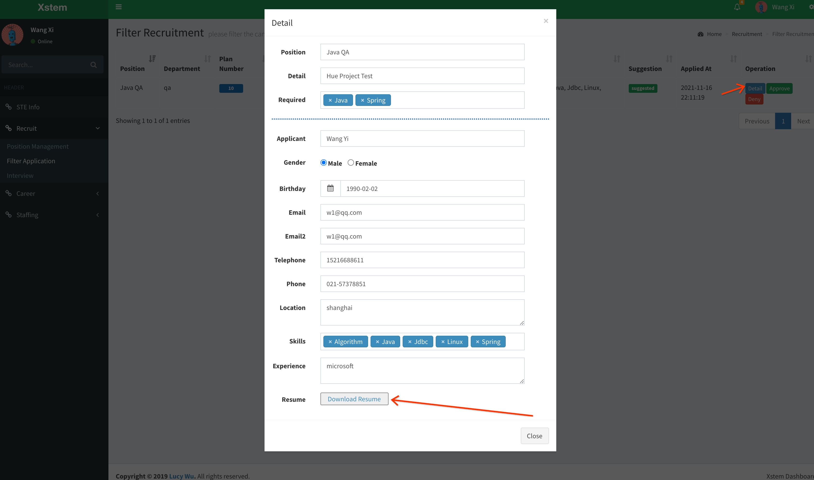

---

* HR arranges interview for the candidate:
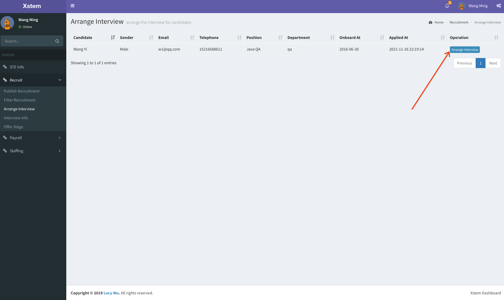
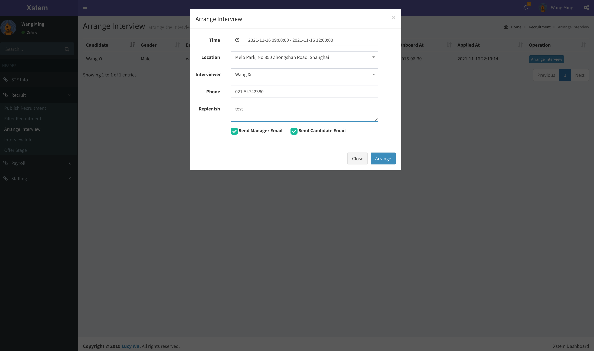

---

* Candidate checks application update:
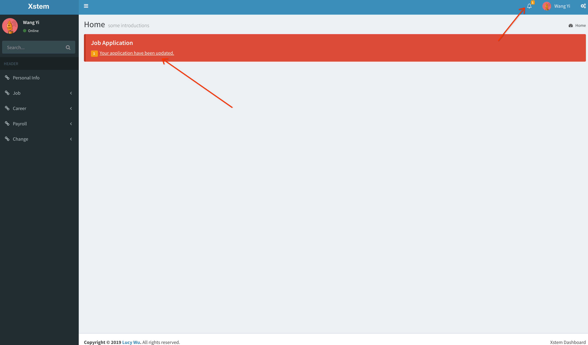

---

* Hiring Manager gets interviews information and conduct interviews:
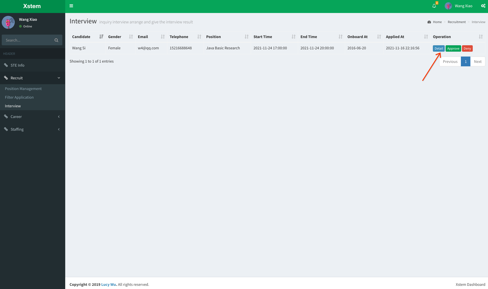
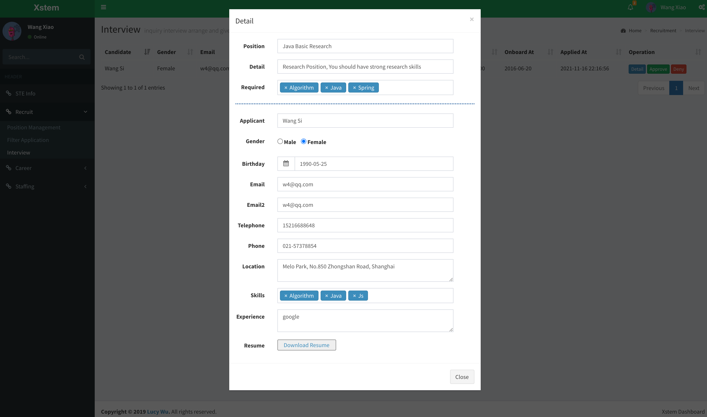

---

* Hiring Manager gets interviews information and conduct interviews:

---

* HR releases offer:
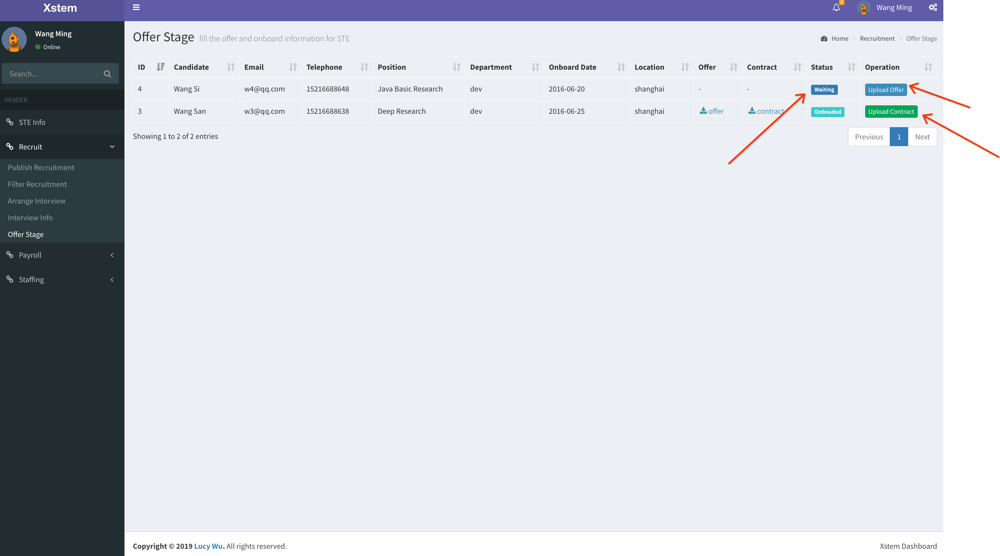

---
