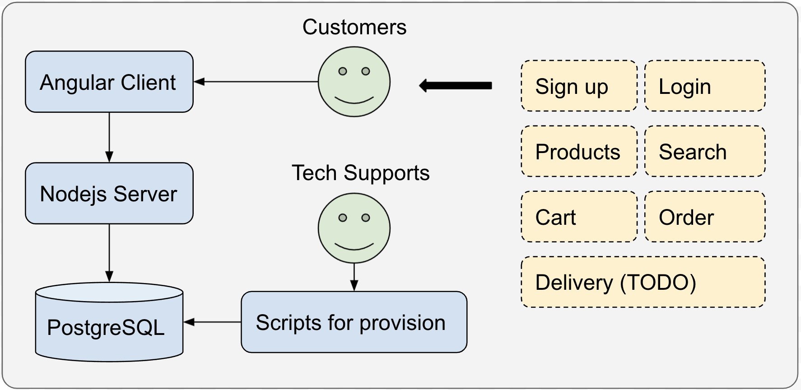
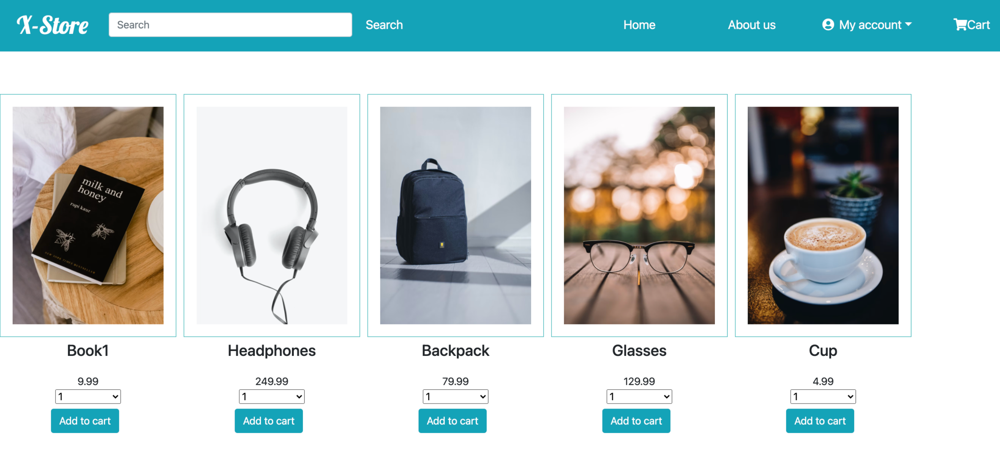
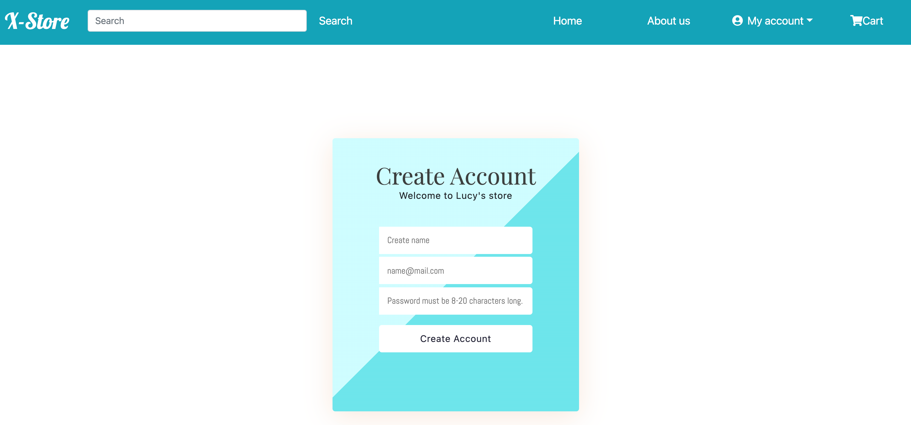
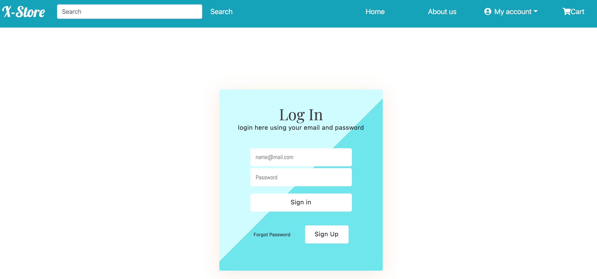
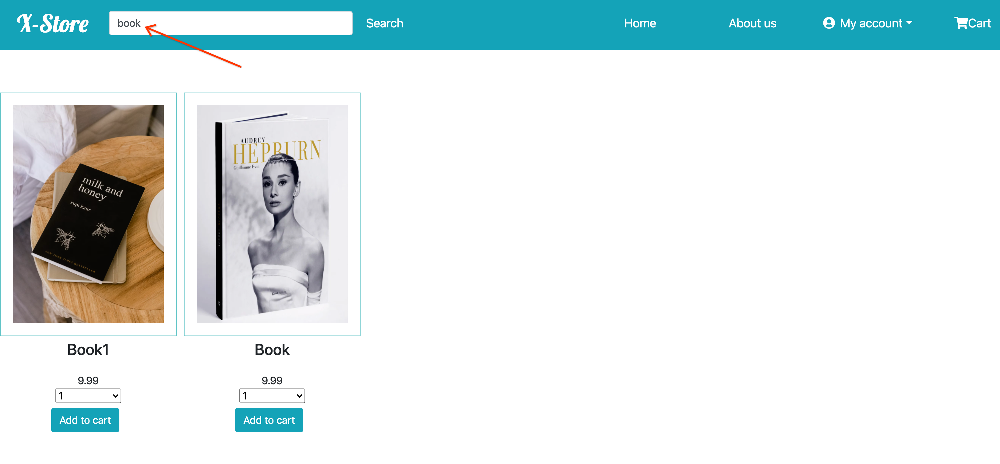
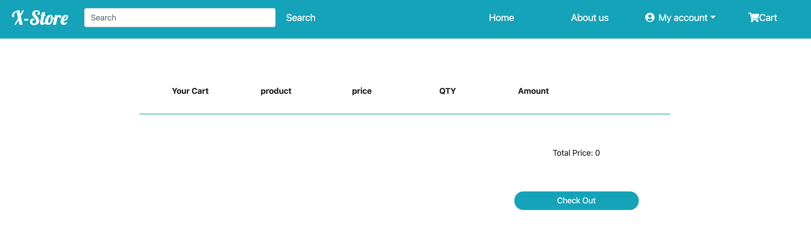
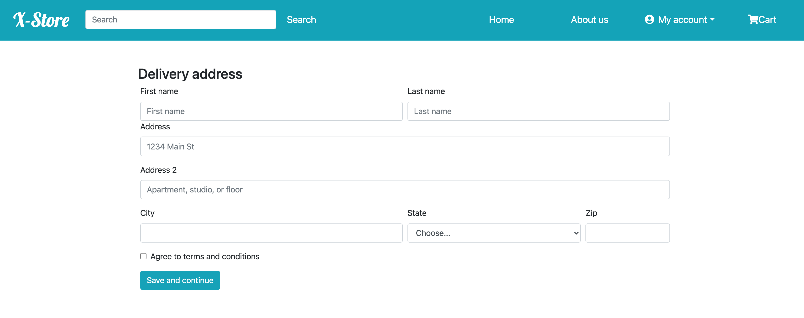

# Online Grocery Store

### Summary

Online Grocery Store is a concise and elegant grocery website, wrote in Angular and deployed on GCP compute engine. It supports basic online shopping features
like products, cart and order to empower the grocery store with the ability of online shopping.

### Demo

* [http://35.225.43.107:4200/](http://35.225.43.107:4200/) (deployed on GCP)
* username: gkvoid1@gmail.com
* password: 1234567890

### Skillset

* **Backend**: *Node.js*, *Express*
* **Frontend**: *Angular*, *Javascript*, *HTML/CSS*
* **Data Storage**: *PostgreSQL*
* **Launch**: *GCP*

### Design & Architecture

### Exhibition

* Grocery Store landing page:

---

* Users can signup the Grocery Store website:

---

* Users can signin the Grocery Store website:

---

* Users can search products:

---

* Users can add products to cart

---

* Users can place order and checkout

---
